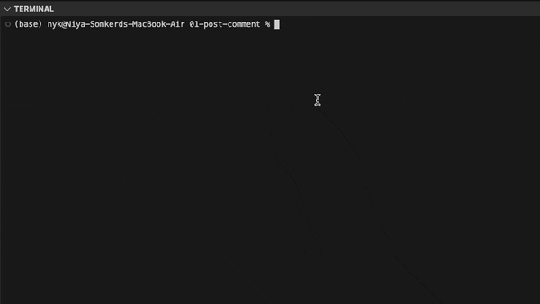
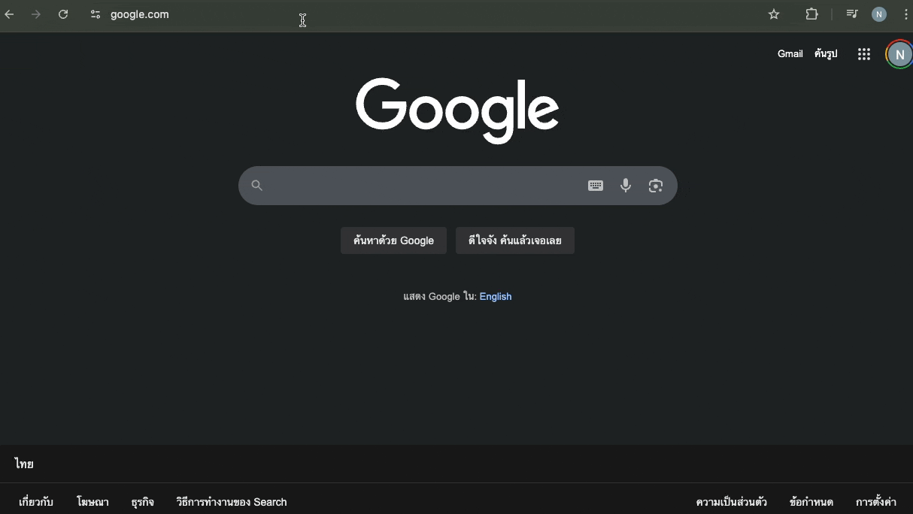

# 📦 k8s-ingress-posts-service

A simple Kubernetes project demonstrating how to deploy a microservice (`posts`) and expose it to the internet using **NGINX Ingress Controller**.

This repo is ideal for learning, testing, and showcasing Ingress routing in Kubernetes.

---

## 🚀 What You’ll Learn

- How to deploy a simple microservice (`posts`) on Kubernetes
- How to expose it using a **ClusterIP** service
- How to route traffic using **NGINX Ingress Controller**
- How to test the setup locally

---

## ⚙️ Prerequisites

Local Development Tools:
- Docker Desktop (with Kubernetes enabled)
- kubectl (Kubernetes CLI)
- skaffold (CLI for continuous dev with Kubernetes)
- Node.js, Express.js
- Ingress-NGINX (https://kubernetes.github.io/ingress-nginx/deploy/#quick-start: If you don't have Helm...)

---


## Installation

### Clone a Git repository into the current directory, run:

```bash
git clone https://github.com/ouyniya/k8s-ingress-microservices-demo.git .
```

### Install dependencies for each service, e.g.,

```bash
cd blog-client
npm install
```

Repeat this for the other service


### Domain Setup (Local Dev)

Edit `/etc/hosts` (Mac/Linux) or `C:\Windows\System32\drivers\etc\hosts` (Windows) to add:

```bash
127.0.0.1   posts.com
```

`ctrl + 0 | ctrl + x | enter`

*** if no other LoadBalancer service is using port `80`, the Ingress controller will typically be assigned localhost as its `EXTERNAL-IP`, making it accessible via `localhost:80`. If that doesn’t work, you can use the kubectl port-forward method

### ✅ Check and free port 80 if it’s in use

```bash
sudo lsof -i :80
```

Kill the process occupying port 80 (replace <PID> with the actual Process ID from the output):

```bash
sudo kill -9 <PID>
```


###  Go back to the root directory and start the development environment with Skaffold:

```bash
cd ..
skaffold dev
```

This command will build your Docker images, apply your Kubernetes configs, and start watching for changes in your microservices.




⚠️ If you encounter any errors
Stop Skaffold with Ctrl + C, then restart it by running:

```bash
skaffold dev
```


### Open your browser and go to:

```bash
http://posts.com
```




---

## 📚 Related Concepts
Kubernetes Deployment

Service (ClusterIP)

Ingress & Ingress Controller

Docker image versioning


## 🙌 Author

Built with ❤️ for learning and experimentation.


## Acknowledgements

Special thanks to the Udemy course [Microservices with Node.js and React](https://www.udemy.com/course/microservices-with-node-js-and-react/) for providing valuable knowledge and guidance that helped in the development of this project.